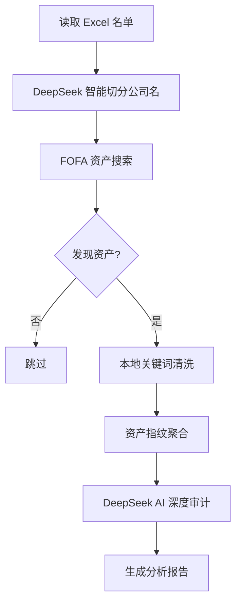

# FOFA Finder CNVD

**FOFA Finder CNVD** 是一款专为网络安全研究人员设计的自动化 CNVD (国家信息安全漏洞共享平台) 挖掘辅助工具。

它结合了 **FOFA 资产测绘** 的广度和 **DeepSeek AI** 的深度分析能力，能够从海量企业名单中自动筛选、发现并审计具有潜在挖掘价值的资产。

## ✨ 核心特性

*   **智能公司名切分 (Smart Split)**: 利用 **DeepSeek AI** 自动分析企业全称，提取最适合搜索引擎的核心品牌词和业务词（例如 "某某网络科技有限责任公司" -> ["某某网络", "某某科技"]），大幅提高搜索命中率。
*   **自动化资产发现**: 从 Excel 企业名单自动读取，利用 FOFA API 或 Web 模式进行多关键词组合搜索。
*   **本地垃圾清洗 (Local Screening)**: 内置关键词过滤机制，在本地毫秒级剔除博彩、色情、导航页等无价值资产，减少 AI Token 消耗。
*   **DeepSeek 深度审计**: 自动调用 DeepSeek V3 API 对发现的资产进行深度分析，识别系统类型（OA/ERP/CMS），判断是否符合 CNVD 收录标准。
*   **双重输出结构**: 支持实时任务查看 (`output/realtime`) 和按日期的归档管理 (`output/YYYY/MM/DD`)。
*   **智能降级模式**: 支持 FOFA API Key 耗尽时自动降级为 Web 爬虫模式，确保任务不中断。

## 🔄 工作流程



## 🚀 快速开始

### 1. 安装依赖

确保您的环境已安装 Python 3.8+。

```bash
pip install -r requirements.txt
```

### 2. 配置

打开 `fofa_finder/config.py`，填入您的 API Key：

```python
# fofa_finder/config.py

# FOFA 配置 (支持多个 Key 轮询)
FOFA_API_KEYS = [
    {"email": "your_email@example.com", "key": "your_fofa_api_key"},
]

# DeepSeek 配置
DEEPSEEK_API_KEY = "sk-xxxxxxxxxxxxxxxxxxxxxxxx"

# 输入文件路径
INPUT_FILE = "company_list.xlsx" 
```

### 3. 准备数据

在项目根目录下放置您的目标企业名单 `company_list.xlsx`。文件应包含“企业名称”列。

### 4. 运行

#### 标准模式 (推荐)
使用 FOFA API 进行搜索，速度快且稳定。如果 API 配额耗尽，程序会自动尝试切换到 Web 模式。

```bash
python -m fofa_finder.main --api-mode
```

#### 省钱/离线模式
强制使用本地训练的 AI 模型进行资产分析，不消耗 DeepSeek Token（准确率略低于 DeepSeek）。

```bash
python -m fofa_finder.main --api-mode --local-ai
```

## 🛠️ 实用工具

项目提供了一些辅助脚本，方便进行单点测试和数据管理。

### 1. 单目标测试 (`single_run.py`)
不想运行整个 Excel？可以使用此脚本快速测试单个公司的挖掘效果。

```bash
# 用法: python -m fofa_finder.single_run [公司名] [--api-mode]
python -m fofa_finder.single_run "百度在线网络技术（北京）有限公司" --api-mode
```

### 2. 数据迁移 (`migrate_output.py`)
将旧版本的扁平化输出目录迁移到新的日期层级结构 (`YYYY/MM/DD`)。

```bash
# 迁移默认 output 目录
python tools/migrate_output.py

# 迁移指定目录
python tools/migrate_output.py d:\path\to\old_output
```

## 📂 输出结构

所有结果保存在 `output/` 目录下，采用双重索引结构：

### 1. 实时会话 (`output/realtime/`)
按运行时间戳存放，方便查看当前任务的最新产物。
*   `output/realtime/20240214_100000/`

### 2. 日期归档 (`output/YYYY/MM/DD/`)
按年月日自动归档，方便长期存储和回溯。
*   `output/2024/02/14/raw_data/`: **原始数据** (FOFA 返回的完整 Excel)
*   `output/2024/02/14/analysis_data/`: **分析报告** (包含 AI 判定结果的 Excel)
*   `output/2024/02/14/report_data/`: **Markdown 简报** (适合快速阅读)

## ⚠️ 免责声明

本工具仅用于授权的安全测试和学术研究。使用者需遵守当地法律法规，严禁用于非法用途。开发者不对使用本工具造成的任何后果负责。

## 📄 License

MIT License
