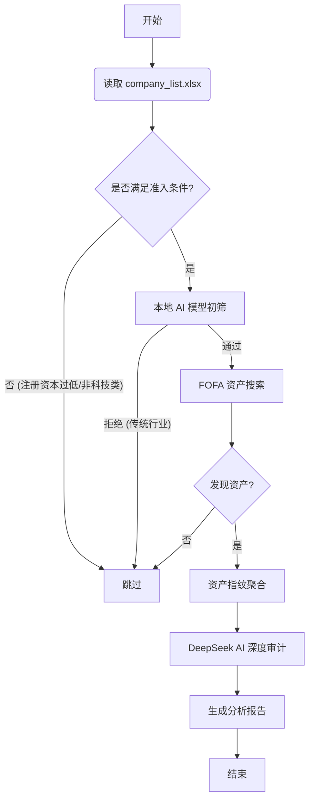

# FOFA Finder CNVD

**FOFA Finder CNVD** 是一款专为网络安全研究人员设计的自动化 CNVD (国家信息安全漏洞共享平台) 挖掘辅助工具。

它结合了 **FOFA 资产测绘** 的广度和 **DeepSeek AI** 的深度分析能力，能够从海量企业名单中自动筛选、发现并审计具有潜在挖掘价值的资产。

## ✨ 核心特性

*   **自动化资产发现**: 从 Excel 企业名单自动读取，利用 FOFA API 进行多关键词组合搜索。
*   **本地 AI 智能初筛**: 内置 TF-IDF + Random Forest 机器学习模型，在本地毫秒级过滤非科技/非软件类公司，大幅节省 API 调用成本。
*   **DeepSeek 深度审计**: 自动调用 DeepSeek V3 API 对发现的资产进行深度分析，判断是否符合 CNVD 收录标准（如是否有自研系统、注册资本是否达标）。
*   **三级漏斗筛选**:
    1.  **Excel 级**: 注册资本 > 5000万 + 经营范围匹配。
    2.  **本地 AI 级**: 过滤餐饮、房地产、物流等非技术驱动型公司。
    3.  **DeepSeek 级**: 深度分析资产指纹，识别通用型系统。
*   **精美报告生成**: 自动生成包含 AI 分析结论的 Excel 和 Markdown 报告。
*   **实时成本监控**: 实时显示 Token 消耗和预计花费金额。

## 🚀 快速开始

### 1. 安装依赖

确保您的环境已安装 Python 3.8+。

```bash
pip install -r requirements.txt
```

### 2. 配置

打开 `fofa_finder/config.py`，填入您的 API Key：

```python
# fofa_finder/config.py

# FOFA 配置
FOFA_API_KEYS = [
    {"email": "your_email@example.com", "key": "your_fofa_api_key"},
]

# DeepSeek 配置
DEEPSEEK_API_KEY = "sk-xxxxxxxxxxxxxxxxxxxxxxxx"

# 输入文件路径
INPUT_FILE = "company_list.xlsx" 
```

### 3. 准备数据

在项目根目录下放置您的目标企业名单 `company_list.xlsx`。文件应包含“企业名称”、“注册资本”、“经营范围”等列。

### 4. 运行

```bash
# 标准模式 (使用 FOFA API + DeepSeek API)
python -m fofa_finder.main --api-mode

# 省钱模式 (强制使用本地 AI 模型进行预判，大幅节省 DeepSeek Token)
python -m fofa_finder.main --api-mode --local-ai
```

## 🖥️ 运行效果

终端输出示例：

```text
┌────────────┬────────────┬────────────────┬──────────────────────────────────────────────────────────────────────────────────────────────────────┐
│    Time    │   Level    │     Module     │                                               Message                                                │
├────────────┼────────────┼────────────────┼──────────────────────────────────────────────────────────────────────────────────────────────────────┤
│  10:00:01  │  INFO      │  Main          │ [1/100] 正在处理: 某某网络科技有限公司 (匹配业务: 软件开发) | 余额≈¥50.23                            │
│  10:00:03  │  INFO      │  FofaClient    │ [API] 搜索关键词: "某某网络科技" && country="CN" -> 发现 15 条资产                                   │
│  10:00:05  │  INFO      │  LocalEngine   │ 本地推理完成: 原始 15 -> 有效 8 -> CNVD重点 3                                                        │
│  10:00:08  │  INFO      │  Analyzer      │ AI 分析完成: 某某网络科技 | 本次花费: ¥0.02 | 累计花费: ¥0.15 | 余额≈¥50.21                          │
│  10:00:08  │  INFO      │  Reporter      │ 报告已保存: output/20260213_100000/ai_reports/某某网络科技_analysis.xlsx                             │
└────────────┴────────────┴────────────────┴──────────────────────────────────────────────────────────────────────────────────────────────────────┘
```

## 🔄 工作流程



## 📂 文件结构与产物

### 1. 输入文件 (`company_list.xlsx`)
项目根目录下必须存在此文件，作为扫描的输入源。建议包含以下列：
*   **企业名称**: (必选) 用于 FOFA 搜索和 AI 判别。
*   **注册资本**: (可选) 用于过滤小微企业。
*   **经营范围**: (可选) 用于辅助判断行业属性。

### 2. 输出产物 (`output/`)
每次运行都会在 `output/` 目录下创建一个以时间戳命名的文件夹（如 `20260213_100000/`），包含以下内容：

| 文件名 | 类型 | 说明 |
| :--- | :--- | :--- |
| `company_raw.xlsx` | Excel | **原始数据**：包含 FOFA 返回的所有资产信息（IP、端口、标题、指纹等）。 |
| `ai_reports/xxx_analysis.xlsx` | Excel | **最终报告**：经过 AI 清洗和审计后的高价值数据。包含 "CNVD候选" 标记。 |
| `ai_reports/xxx_analysis.md` | Markdown | **简报**：适合快速阅读的分析摘要，列出了 AI 的判断理由和重点资产。 |
| `fofa_finder.log` | Log | **运行日志**：记录了程序的详细运行过程、API 消耗和错误信息。 |

### 3. 核心代码结构
```
fofa_finder_cnvd/
├── fofa_finder/
│   ├── config.py           # 配置文件 (API Key, 阈值等)
│   ├── main.py             # 程序入口
│   ├── learning/           # 本地机器学习模块 (训练/推理)
│   └── modules/            # 核心功能模块 (FOFA, AI, Report)
├── requirements.txt        # 依赖包列表
└── README.md               # 本文档
```

## 🧠 本地 AI 模型

本项目包含两个预训练的轻量级模型（位于 `learning/` 目录），用于离线过滤：

1.  **company_model.pkl**: 根据公司名称判断是否为“科技/软件”公司。
2.  **cnvd_model.pkl**: 根据资产标题判断是否为“CNVD 重点”资产（如后台、OA、系统）。

您可以利用自己的数据重新训练这些模型：
```bash
python fofa_finder/learning/extract_company_data.py  # 从日志提取训练数据
python fofa_finder/learning/train_company_model.py   # 训练模型
```

## ⚠️ 免责声明

本工具仅用于授权的安全测试和学术研究。使用者需遵守当地法律法规，严禁用于非法用途。开发者不对使用本工具造成的任何后果负责。

## 📄 License

MIT License
